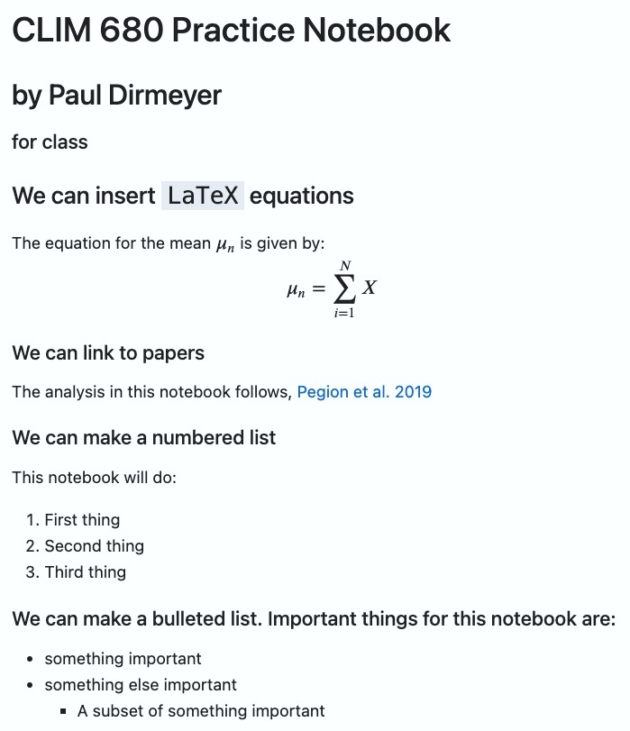

### JupyterLab (Jupyter Notebook)

JupyterLab allows us to create Jupyter Notebooks which can contain a combination of code, figures, links, formatted text, and even LaTex equations.   

It is also a web-based programming interface for mutiple languages (e.g. Python, R, Julia...).  We will use it as our Python programming interface.

Because it also allows figures, links, text, and equations in addition to code, it is very useful for use in research allowing all your information related to your research to be kept together rather than in separate documents. It's like a fancy, high-tech research journal!

### Creating and working with a Jupyter Notebook

First, let's create a new Jupyter Notebook by clicking in the menu bar `File`->`New`->`Notebook` 
or in the Launcher clicking on `Python 3 (ORC)` in the row labeled **Notebook**
This creates a new notebook with a default title `Untitled.ipynb` or `Untitled#.ipynb`. Note that Jupyter Notebooks end in `.ipynb`

Change the name of your notebook to `PracticeNotebook.ipynb` by clicking `File`->`Save Notebook As`  

Each rectangular box in your notebook is called a `cell` it contains a block of `code`, `Markdown` text, or `Raw` text.  What a `cell` contains is indicated in the menu above. 

To determine what kind of **code** our notebook will contain and run, the **kernel** is shown in the upper right.  This notebook contains `Python 3` code. `(ORC)` is the **environment**, which has a preset list of libraries available to import. Later we will learn how to make and modify environments.

## What is Markdown?

Markdown is a formatting language that allows you to provide basic formatted text (e.g. bold, italics, links, different sized font, and LaTeX equations). It's not as fancy as what you could do with a word processor, but for documenting projects in Jupyter notebooks, it gets the job done nicely!

As an example, let's type the following in a cell and change the cell to Markdown:

> ~~~
> # CLIM 680 Practice Notebook
> ## by {your name here}
> #### for class
>
> ### We can insert `LaTeX` equations
> The equation for the mean $\mu_n$ is given by: 
> $$ \mu_n=\sum_{i=1}^{N}X $$
> 
> #### We can link to papers
> The analysis in this notebook follows, [Pegion et al. 2019](https://doi.org/10.1175/BAMS-D-18-0270.1)
> 
> #### We can make a numbered list 
> This notebook will do:
> 1. First thing
> 2. Second thing
> 3. Third thing
> 
> #### We can make a bulleted list. Important things for this notebook are:
> * something important
> * something else important
>   * A subset of something important
> ~~~
{: .source}

Once you are finished, **run** the cell by either:

* Clicking the "play" button ▶ at top of the tab

* Typing `shift-return`
  
Your result should look something like this once you run the cell:

  
> ## What is LaTeX (and why do you type it like that)?
>
> LaTeX (pronounced "lah-tek" or "lay-tek" but never "lay-teks")
> is a simple text-based protocol for encoding text to be formatted for publication printing.
> It evolved from the days before word processors, and even before GUI operating systems like 
> Windows and Mac OS, when _everything_ about computing had to be typed at the command like of a terminal window.
> 
> LaTeX was started in the mid 1980s as a publication-quality protocol for encoding typesetting commands as
> a set of special codes embedded within normal text. It is still very popular to this day, 
> especially with mathematicians, physicists and others who write a lot of equations. 
> It's system is considered easier and faster to type than the equation coding 
> systems of apps like Microsoft Word. 
> In fact, it's so popular that modern versions of Word allow users the option to use LaTeX syntax in its own equation editor.
>
> Here is a handy [guide](https://en.wikibooks.org/wiki/LaTeX/Mathematics){:target="_blank" rel="noopener"} for rendering mathematical 
> symbols and expressions in LaTeX, which will also render nicely in markdown cells within Jupyter notebooks.
> 
{: .callout}

  
  

