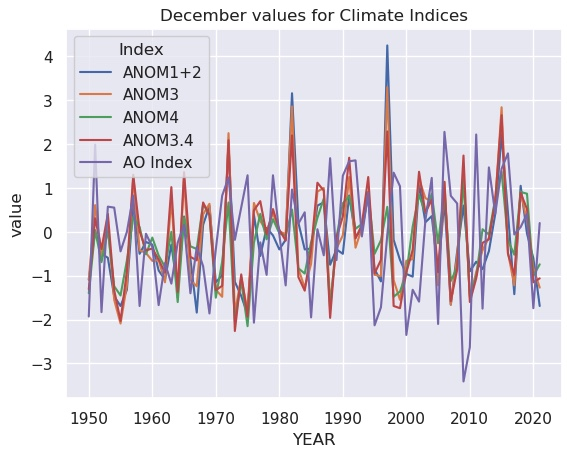
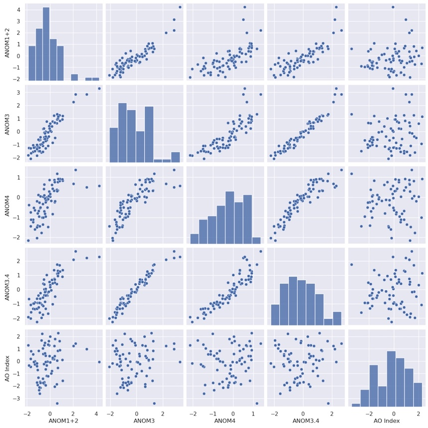
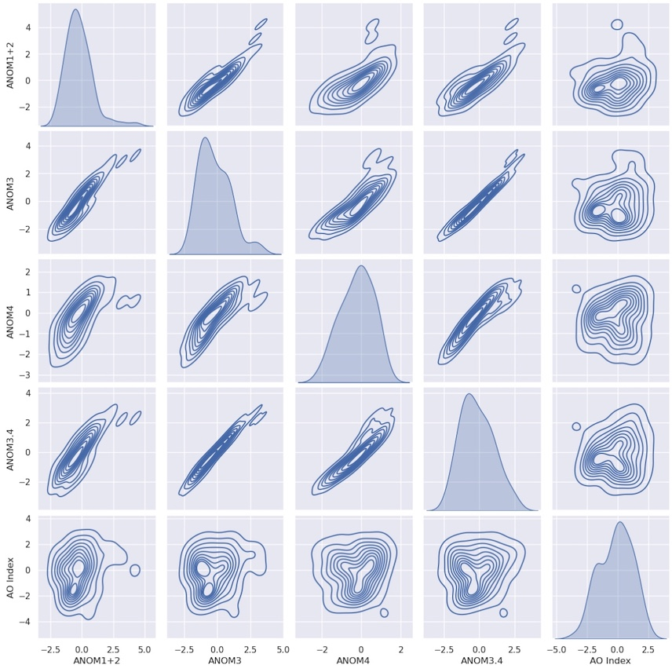

## More about Pandas

**Pandas** is designed for analyzing tabular data. 
Climate model output is rarely in tabular form, but often observational data is. 
Such data may be in the form of plain text files, or more often **comma-separated files** that have the suffix `.csv`
Note that the separator does not have to be a comma - any unique charater will work (e.g., semicolons, tabs, or spaces).

Spreadsheet apps like _Microsoft Excel_ and _Google Sheets_ easily read and write out files in **CSV** format.

Open a new Jupyter notebook. We will need to import both `pandas` and `seaborn`.

~~~
import pandas as pd
import seaborn as sns
~~~
{: .language-python}

We will use some of the [monthly climate index data from NOAA](https://psl.noaa.gov/data/climateindices/list/), 
which has been placed in the `pandas_data` directory with the name: `monthly_climate_indices.csv`

Let's open the file as a Pandas DataFrame and have a look:

~~~
file = "classes/clim680_2022/pandas_data/monthly_climate_indices.csv"
df = pd.read_csv(file)
df
~~~
{: .language-python}

~~~
	YEAR	MONTH	NINO1+2	ANOM1+2	NINO3	ANOM3	NINO4	ANOM4	NINO3.4	ANOM3.4	AO Index
0	1950	1	23.01	-1.55	23.56	-2.10	26.94	-1.38	24.55	-1.99	-0.06030
1	1950	2	24.32	-1.78	24.89	-1.52	26.67	-1.53	25.06	-1.69	 0.62700
2	1950	3	25.11	-1.38	26.36	-0.84	26.52	-1.80	25.87	-1.42	-0.00813
3	1950	4	23.63	-1.90	26.44	-1.14	26.90	-1.73	26.28	-1.54	 0.55500
4	1950	5	22.68	-1.74	25.69	-1.57	27.73	-1.18	26.18	-1.75	 0.07160
...	...	...	...	...	...	...	...	...	...	...	...
868	2022	5	22.77	-1.65	26.20	-1.06	28.10	-0.81	26.81	-1.12	 1.22000
869	2022	6	21.65	-1.48	25.81	-0.81	28.25	-0.72	26.97	-0.76	-0.08400
870	2022	7	20.77	-1.19	25.27	-0.53	27.90	-1.00	26.59	-0.70	 0.01780
871	2022	8	20.43	-0.58	24.44	-0.68	27.69	-1.10	25.87	-0.98	-0.18000
872	2022	9	19.70	-1.02	23.94	-0.97	27.58	-1.18	25.62	-1.09	-0.66100
873 rows × 11 columns
~~~
{: .output}

## Calculate a climatology from a Pandas DataFrame

This works in the same way as we have seen for **xarray** - in fact, 
**xarray** uses several of the techniques from **Pandas**, 
such as **Pandas**' elegant handling of missing data, and its time/caledar features.

Here, we will use the `groupby` method learned previously. 
It works very similarly for **xarray** and **Pandas**; there is a slight 
difference in the arguments and parameters, 
but both produce a _groupby object_ that we can aggregate.

~~~
df_climo = df.groupby(['MONTH']).mean()
df_climo
~~~
{: .language-python}

~~~
    YEAR   NINO1+2   ANOM1+2   NINO3      ANOM3     NINO4     ANOM4    NINO3.4   ANOM3.4   AO Index
MONTH										
 1 1986.0 24.277671 -0.288356 25.477534 -0.182055 28.085205 -0.233973 26.408767 -0.135890 -0.362575
 2 1986.0 25.778630 -0.321781 26.232603 -0.173288 27.984658 -0.212329 26.614658 -0.137123 -0.318233
 3 1986.0 26.174521 -0.313151 27.008904 -0.195205 28.087671 -0.232740 27.116712 -0.165890 -0.037440
 4 1986.0 25.256438 -0.279315 27.298493 -0.282466 28.362603 -0.264795 27.566575 -0.251781  0.098748
 5 1986.0 24.058082 -0.358082 26.926712 -0.325068 28.673425 -0.242466 27.681507 -0.251781  0.012021
 6 1986.0 22.804247 -0.320000 26.335068 -0.283973 28.706986 -0.262055 27.499315 -0.228493  0.004055
 7 1986.0 21.688767 -0.270685 25.545616 -0.259452 28.595205 -0.302466 27.070685 -0.222466 -0.111214
 8 1986.0 20.765890 -0.240685 24.903562 -0.214110 28.459589 -0.329315 26.655068 -0.199863 -0.134370
 9 1986.0 20.462877 -0.263699 24.710137 -0.191233 28.436712 -0.323699 26.542192 -0.176438 -0.004132
10 1985.5 20.751528 -0.264306 24.758889 -0.221389 28.458889 -0.301528 26.520278 -0.196389 -0.019480
11 1985.5 21.435833 -0.218750 24.866806 -0.235694 28.425694 -0.270833 26.504167 -0.198333 -0.075086
12 1985.5 22.580278 -0.230000 25.035000 -0.192361 28.304306 -0.235417 26.447361 -0.150833 -0.138510
~~~
{: .output}

> ## See what we did and notice the results...
> As we saw in the previous **Pandas** lessons with the `.loc` method, 
> we specify the name of the column around which we group the data (`MONTH`) 
> as a string (to give the name of the column) inside square brackets: `['MONTH']`.
> 
> The aggregator `mean()` has calculated averages for all the other columns in the DataFrame.
> > For the column `YEAR`, this averaging is kind of meaningless - the 
> > climatology does not have an associated year, but rather the range of years in the DataFrame.
> >
> > The columns representing anomalies for the El Niño indices are not equal to zero. Why? 
> 
> This last point is an important one for scientists - you should always be on the 
> lookout for irregularities like this. When you find one, investigate it. 
> Does this mean we did something wrong, or is there another explanation? 
> What could cause such a result? Let's track it down...
> 
> > ## Solution
> > Click on the link at the top of this notebook for the source of this data, 
> > then scroll down to the entry called __Niño 3*__.
> > 
> > There is a clue in the file name there, but let's look further: 
> > click on the link for __NOAA Climate Prediction Center(CPC)__.
> > 
> > Scroll down, under **Sea Surface Temperature (SST)** and **Monthly** ERSSTv5, 
> > where the four different indices are listed. What does it say about the base period?
> > 
> > The base period is 1991-2020. We took an avearge across all the data, which start from 1950.
> > We should not expect the 30-year anomaly to match the anomaly calculated acros a different period, 
> > especially when there are trends. The negative values above, result from including
> > the 41 years prior to 1991, prior to the increasing effects of global warming.
> {: .solution}
{: .challenge}

Below is an example of how we can choose only rows where the values in a specific column
(here, `YEAR`) have a specific value or range of values. 
With this, we can limit the calculation of the monthly climatology to a range of years.

~~~
df_climo = df.loc[(df['YEAR'] >= 1991) & (df['YEAR'] <= 2020)].groupby(['MONTH']).mean()
df_climo
~~~
{: .language-python}

~~~
    YEAR   NINO1+2   ANOM1+2    NINO3       ANOM3       NINO4     ANOM4    NINO3.4    ANOM3.4	AO    Index
MONTH										
 1 2005.5 24.565333 -0.000667 25.658667 -1.000000e-03 28.319000 -0.000667 26.544333  7.401487e-18  0.000233
 2 2005.5 26.099667 -0.000333 26.405000 -2.775558e-18 28.197333  0.000333 26.752333  6.666667e-04  0.119400
 3 2005.5 26.488000  0.000667 27.203667 -3.333333e-04 28.321000  0.000333 27.283000  1.000000e-03  0.255533
 4 2005.5 25.536000 -0.000333 27.580667 -3.333333e-04 28.627000 -0.000667 27.818667 -3.333333e-04  0.145687
 5 2005.5 24.415333 -0.001000 27.251333 -6.666667e-04 28.916667  0.000667 27.933333  3.333333e-04  0.059827
 6 2005.5 23.124667 -0.000667 26.619333  3.700743e-18 28.969000  0.000333 27.726667  3.700743e-18 -0.032170
 7 2005.5 21.959000 -0.000333 25.804667  0.000000e+00 28.898667  0.001000 27.293333  1.850372e-18 -0.146541
 8 2005.5 21.006000 -0.001000 25.118333  3.333333e-04 28.788333 -0.000333 26.855000  0.000000e+00 -0.005027
 9 2005.5 20.726333 -0.000333 24.901333 -3.700743e-18 28.761333  0.000333 26.718667 -1.000000e-03  0.042643
10 2005.5 21.022000  0.005333 24.981333  1.333333e-03 28.760667  0.000333 26.716333  3.333333e-04 -0.218530
11 2005.5 21.659333  0.004000 25.103000  3.333333e-04 28.697000 -0.000333 26.702667 -6.666667e-04  0.170653
12 2005.5 22.817333  0.007000 25.229667  2.666667e-03 28.539333 -0.000667 26.599000  6.666667e-04 -0.045037
~~~
{: .output}

Now the anomalies are very small - essentially zero, 
within the range of precision of our original data (0.01˚C, 
so a 30-year mean may be off by a few thirtieths times one hundredth of a degree). 
Interestingly, a few values are still suspiciously large (e.g., `ANOM1+2` for October-December)!

## Preparing Data for Seaborn

[Seaborn](http://seaborn.pydata.org) is a Python data visualization library build atop **matplotlib**. 
It is designed to work with **Pandas** DataFrames, 
particularly to combine data from multiple columns in a single visualization.

To take full advantage of **Seaborn**, let's rearrange our DataFrame. 
Use the `melt` method to combine the index columns into a single column of values, 
and add a new column that indicates the name of the index. 
We will maintain values for each month and year.

~~~
melted_df = pd.melt(df, id_vars=['YEAR','MONTH'], value_vars=['ANOM1+2','ANOM3','ANOM4','ANOM3.4','AO Index'],var_name='Index')
melted_df
~~~
{: .language-python}

~~~
      YEAR MONTH   Index   value
   0  1950   1    ANOM1+2 -1.5500
   1  1950   2    ANOM1+2 -1.7800
   2  1950   3    ANOM1+2 -1.3800
   3  1950   4    ANOM1+2 -1.9000
   4  1950   5    ANOM1+2 -1.7400
 ...   ...  ...    ...     ...
4360  2022   5   AO Index  1.2200
4361  2022   6   AO Index -0.0840
4362  2022   7   AO Index  0.0178
4363  2022   8   AO Index -0.1800
4364  2022   9   AO Index -0.6610
4365 rows × 4 columns
~~~
{: .output}

You can see that the new DataFrame has fewer columns, 
but the rows are grouped by index (the old columns) by default.

We can re-sort this DataFrame so that the rows progress in order of time.

~~~
sorted_df = melted_df.sort_values(by=['YEAR', 'MONTH'],ignore_index=True)
sorted_df
~~~
{: .language-python}

~~~
      YEAR MONTH	 Index   value
   0  1950   1    ANOM1+2 -1.5500
   1  1950   1      ANOM3 -2.1000
   2  1950   1      ANOM4 -1.3800
   3  1950   1    ANOM3.4 -1.9900
   4  1950   1   AO Index -0.0603
 ...   ...  ...     ...       ...
4360  2022   9    ANOM1+2 -1.0200
4361  2022   9      ANOM3 -0.9700
4362  2022   9      ANOM4 -1.1800
4363  2022   9    ANOM3.4 -1.0900
4364  2022   9   AO Index -0.6610
4365 rows × 4 columns
~~~
{: .output}

## Plotting with Seaborn

We can plot this data in multiple ways with very succinct plotting functions. 
The power of Seaborn is that the data in any column can be used to determine 
aspects of the plot (e.g., color, line style, symbol shape, size).

Here we plot time series of the December values of each index, 
where the line color corresponds to the different indices. 
The appropriate legend is automatically generated.

~~~
sns.set_theme(style="darkgrid")
sx = sns.lineplot(x="YEAR",y="value", hue="Index",
                  data=sorted_df.query("MONTH == 12"))
sx.set_title("December values for Climate Indices") ;
~~~
{: .language-python}

The dark theme with white grid lines is a trademark of **Seaborn** plots.

Not surprisingly, the various ENSO indices are highly correlated. 
The Acrtic Oscillation appears it might be anti-correlated with El Niño.

We can display how all these indices relate to each other with the `pairplot` method. 
We will go back to our original DataFrame for this, and extract only the anomaly indices for plotting:

~~~
columns=['ANOM1+2','ANOM3','ANOM4','ANOM3.4','AO Index']
sns.pairplot(df.query("MONTH == 12")[columns]) ;
~~~
{: .language-python}

Each index is scattered against every other index. 
Along the diagonal, a scatter plot would result in a perfect correlation and not 
reveal any useful new information, so instead a histogram of the probability 
distribution for each index is plotted automatically.

This is probably not the kind of plot you would use in a presentation or publication, 
but it is very good for getting a _quick look_ at your data and how the variables might relate. 
We can see that the El Niño indices are quite well correlated with each other, 
but the suspected anticorrelation with the AO index is not apparent.

There is an option to plot kernel density instead:

~~~
sns.pairplot(df.query("MONTH == 12")[columns], kind="kde") ;
~~~
{: .language-python}


